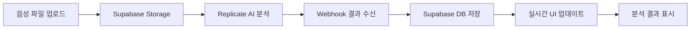

# 🎙️ Feple Dashboard

Feple Dashboard는 **AI 기반 음성 상담 분석 시스템**으로, 고객 상담사의 성과를 실시간으로 평가하고 관리할 수 있는 종합 대시보드입니다.

## ✨ 주요 기능

### 🤖 **AI 음성 분석**

- **실시간 오디오 분석**: Replicate AI를 통한 상담 내용 실시간 분석
- **감정 분석**: 고객과 상담사의 감정 변화 추적
- **대화 품질 평가**: 존댓말 사용률, 공감 표현, 응답 속도 등 종합 평가
- **자동 전사**: 음성을 텍스트로 변환하여 대화 내용 시각화

### 📊 **성과 관리**

- **개인 대시보드**: 상담사별 성과 지표 및 개선 포인트 제공
- **팀 관리**: QC 담당자를 위한 팀 전체 성과 모니터링
- **실시간 알림**: 위험 상황 및 개선 필요 사항 즉시 알림
- **상세 리포트**: 상담 세션별 상세 분석 결과 제공

### 🎯 **사용자 맞춤형 인터페이스**

- **역할별 접근**: 상담사용/QC팀용 분리된 인터페이스
- **반응형 디자인**: 데스크톱, 태블릿, 모바일 최적화
- **실시간 업데이트**: 분석 결과 실시간 반영

## 🚀 기술 스택

### **Frontend**

- **Framework**: Next.js 15.3.5 (App Router)
- **Language**: TypeScript 5.x
- **UI Library**: React 19
- **Styling**: Tailwind CSS + Radix UI
- **Animation**: Framer Motion
- **Icons**: Heroicons + Lucide React
- **Charts**: Recharts
- **HTTP Client**: Axios

### **Backend & AI**

- **AI Platform**: Replicate (음성 분석 모델)
- **Database**: Supabase (PostgreSQL)
- **ORM**: Prisma
- **File Storage**: Supabase Storage
- **Real-time**: Webhook 기반 실시간 업데이트

### **DevOps & Deployment**

- **Hosting**: Vercel
- **Version Control**: Git + GitHub
- **Package Manager**: npm
- **Build Tool**: Turbopack
- **Linting**: ESLint + Next.js Config

## 📁 프로젝트 구조

```
src/
├── app/                    # Next.js App Router
│   ├── api/               # API Routes
│   │   ├── analyze-url/   # 음성 분석 시작
│   │   ├── webhook/       # Replicate 콜백 처리
│   │   └── predictions/   # 분석 결과 조회
│   ├── consultant/        # 상담사 전용 페이지
│   │   ├── upload/        # 음성 파일 업로드
│   │   └── performance/   # 개인 성과 조회
│   ├── qc/               # QC팀 전용 페이지
│   ├── layout.tsx        # 글로벌 레이아웃
│   └── page.tsx          # 역할 선택 홈페이지
├── components/           # 재사용 컴포넌트
│   ├── ui/              # 기본 UI 컴포넌트
│   │   ├── Button.tsx
│   │   ├── Card.tsx
│   │   ├── Select.tsx
│   │   └── Badge.tsx
│   ├── ResultsDisplay.tsx # 분석 결과 표시
│   ├── DashboardLayout.tsx
│   └── Sidebar.tsx
├── hooks/               # Custom Hooks
│   ├── useConsultants.ts
│   ├── usePerformance.ts
│   ├── usePagination.ts
│   ├── useFilters.ts
│   └── useModal.ts
├── context/            # React Context
│   └── AnalysisResultContext.tsx
├── lib/               # 유틸리티 및 설정
│   ├── supabaseClient.ts
│   └── utils.ts
├── types/             # TypeScript 타입 정의
├── constants/         # 상수 및 설정
└── styles/           # 스타일 관련
```

## 🔧 설치 및 실행

### **사전 요구사항**

- Node.js 18+
- npm 또는 yarn
- Supabase 프로젝트
- Replicate API 키

### **환경 변수 설정**

```bash
# .env.local
NEXT_PUBLIC_SUPABASE_URL=your_supabase_url
NEXT_PUBLIC_SUPABASE_ANON_KEY=your_supabase_anon_key
SUPABASE_SERVICE_ROLE_KEY=your_service_role_key
DATABASE_URL=your_database_url
REPLICATE_API_TOKEN=your_replicate_token
```

### **설치 및 실행**

```bash
# 의존성 설치
npm install

# 개발 서버 실행
npm run dev

# 프로덕션 빌드
npm run build
npm start

# 데이터베이스 시드
npm run db:seed
```

## 🎯 사용 방법

### **1. 역할 선택**

- 홈페이지에서 **상담사** 또는 **QC팀** 역할 선택

### **2. 상담사 워크플로우**

1. **상담사 대시보드** 접속
2. **음성 파일 업로드** (MP3, WAV 등)
3. **AI 분석 대기** (실시간 진행 상황 표시)
4. **분석 결과 확인** (성과 지표, 개선 포인트, 전사 내용)

### **3. QC팀 워크플로우**

1. **QC 대시보드** 접속
2. **전체 상담사 성과** 모니터링
3. **위험 알림** 확인 및 조치
4. **상세 리포트** 생성 및 피드백

## 📊 AI 분석 지표

### **대화 품질 지표**

- 존댓말 사용률
- 긍정/부정 표현 비율
- 공감 표현 비율
- 완곡어 사용률
- 사과 표현 비율

### **상담 효율성 지표**

- 평균 응답 속도
- 대화 가로채기 횟수
- 문제 해결 제안 수준
- 고객 감정 변화 추이

### **전체 평가**

- 상담 주제 분류
- 해결 상태
- 종합 점수
- 개선 권장사항

## 🔄 데이터 플로우



## 🎭 개발 모드 - Mock 데이터 연동

**현재 개발 단계에서는 Mock 데이터를 사용하여 UI/UX를 개발하고 있습니다.**

### **Mock 데이터 사용 현황**

- **QC 대시보드**: Mock 데이터로 상담사별 평가 결과 표시
- **상담사 성과**: 실제 Replicate AI 분석 결과와 동일한 구조의 Mock 데이터
- **실시간 업데이트**: Mock 데이터를 통한 UI 동작 검증

### **API 연동 준비**

- **API 코드 보존**: 기존 API 연결 코드는 삭제하지 않고 유지
- **환경 변수 제어**: `NEXT_PUBLIC_USE_MOCK_DATA` 환경 변수로 Mock/API 모드 전환
- **점진적 전환**: 완성된 기능부터 순차적으로 실제 API 연동 예정

### **Mock 데이터 구조**

```typescript
// src/data/qcMockData.ts
export const consultantSessionMapping = {
  c1: [1101, 1102], // 김민수 - 2개 평가 세션
  c2: [1105, 1106], // 박성호 - 2개 평가 세션
  c4: [1103, 1104], // 이영희 - 2개 평가 세션
  c7: [1107, 1108], // 최미연 - 2개 평가 세션
  c12: [1109, 1110], // 노준석 - 2개 평가 세션
};
```

### **Mock 데이터 활용 방법**

1. **QC 성과 페이지** (`/qc/performance`)에서 부서 → 상담사 선택
2. **조회 버튼** 클릭 시 해당 상담사의 Mock 평가 데이터 표시
3. **세션 클릭** 시 상세 피드백 및 코칭 포인트 확인

### **향후 API 연동 계획**

- **1단계**: Mock 데이터로 UI/UX 완성
- **2단계**: Replicate AI 분석 결과 API 연동
- **3단계**: Supabase 실시간 데이터 연동
- **4단계**: 실제 음성 파일 업로드 및 분석 연동

## 🔐 보안 및 권한

- **역할 기반 접근 제어**: 상담사/QC팀 분리된 권한
- **파일 업로드 검증**: 음성 파일 형식 및 크기 제한
- **API 보안**: 환경 변수를 통한 인증 키 관리
- **데이터 암호화**: Supabase 기본 암호화 적용

## 🚀 배포

### **Vercel 배포 (추천)**

```bash
# Vercel CLI 설치
npm i -g vercel

# 배포
vercel --prod
```

### **환경 변수 설정**

Vercel Dashboard에서 다음 환경 변수들을 설정해야 합니다:

- `NEXT_PUBLIC_SUPABASE_URL`
- `NEXT_PUBLIC_SUPABASE_ANON_KEY`
- `SUPABASE_SERVICE_ROLE_KEY`
- `DATABASE_URL`
- `REPLICATE_API_TOKEN`

## 🤝 기여 방법

1. **Fork** 후 로컬에 클론
2. **Feature branch** 생성 (`git checkout -b feature/amazing-feature`)
3. **커밋** (`git commit -m 'Add amazing feature'`)
4. **Push** (`git push origin feature/amazing-feature`)
5. **Pull Request** 생성

## 📝 라이센스

이 프로젝트는 MIT 라이센스를 따릅니다.

## 📞 지원

- **이슈 리포팅**: GitHub Issues
- **기능 요청**: GitHub Discussions
- **문의사항**: 프로젝트 관리자에게 연락

---

## 🔮 향후 계획

- [ ] **실시간 모니터링**: WebSocket을 통한 실시간 상담 모니터링
- [ ] **고급 분석**: 감정 변화 패턴, 고객 만족도 예측
- [ ] **자동 코칭**: AI 기반 개인별 맞춤 코칭 제안
- [ ] **다국어 지원**: 영어, 중국어 상담 분석 지원
- [ ] **모바일 앱**: React Native 기반 모바일 앱 개발

**Made with ❤️ for better customer service**
